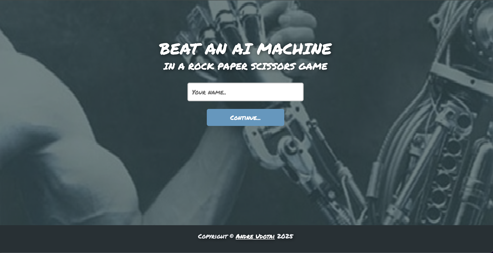

# Rock Paper Scissors

This is a simple implementation of the classic "Rock, Paper, Scissors" game.



## Features

- Play against the computer.
- Randomized computer choices.
- Tracks the winner of each round.

## Installation

1. Clone the repository:
    ```bash
    git clone https://github.com/your-username/rock-paper-scissors.git
    ```
2. Navigate to the project directory:
    ```bash
    cd rock-paper-scissors
    ```
3. Ensure you have Python (or the required runtime) installed.

## Usage

Run the game using the following command:
```bash
python main.py
```

Follow the on-screen instructions to play.

## Contributing

Contributions are welcome! Feel free to open issues or submit pull requests.

## License

This project is licensed under the [MIT License](LICENSE).

## Acknowledgments

Inspired by the classic game "Rock, Paper, Scissors."